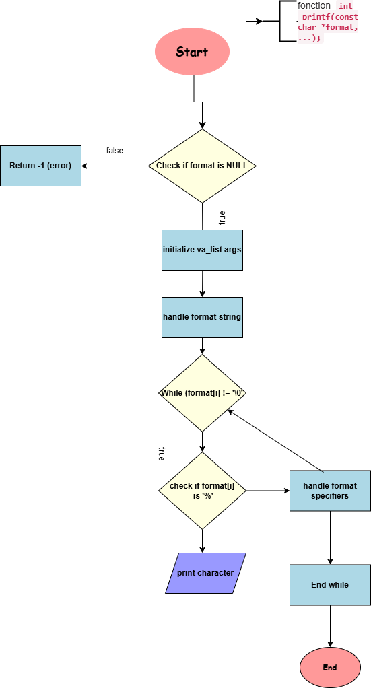

# Custom Printf Project

## Description of the Project and the printf Function

The aim of this project is to create a simplified version of the `printf` function in C, called `_printf`. This function formats and displays data on the standard output, just like the standard `printf` function. It supports the following format specifiers:
- `%c` : Displays a character.
- `%s` : Displays a string of characters.
- `%%` : Displays a literal percentage character.
- `%d`, `%i` : Displays a signed integer in decimal.

The aim of this project is to understand how variadic functions work in C and to put string formatting and display management into practice.

## Compilation order

To compile the program, use the following command:

```sh
gcc -Wall -Werror -Wextra -pedantic -std=gnu89 -Wno-format *.c -o printf
```

## Exigences

	- Operating system: Ubuntu 20.04 LTS
	- Compiler: GCC
	- Tools: git
	- Code style: Conformance with Betty standards


## Examples of use

Here are some examples of how to use the _printf function:

```sh
#include "main.h"

int main(void)
{
    _printf("Character: %c\n", 'A');
    _printf("String: %s\n", "Hello, world!");
    _printf("Percent sign: %%\n");
    _printf("Integer: %d\n", 12345);
    _printf("Negative integer: %i\n", -6789);
    return (0);
}
```

## SEE ALSO

printf(3), putchar(3)


## AUTHOR

Written by Jean-Paul & Guney


## README

[text](man_3_printf.3)


## Testing

To test the code, we used several usage examples to check that the various format specifiers worked properly. We also used Valgrind to check for memory leaks and ensure that our code was robust and error-free.

To run Valgrind, use the following command:

```sh
valgrind --leak-check=full --track-origins=yes ./printf
```

